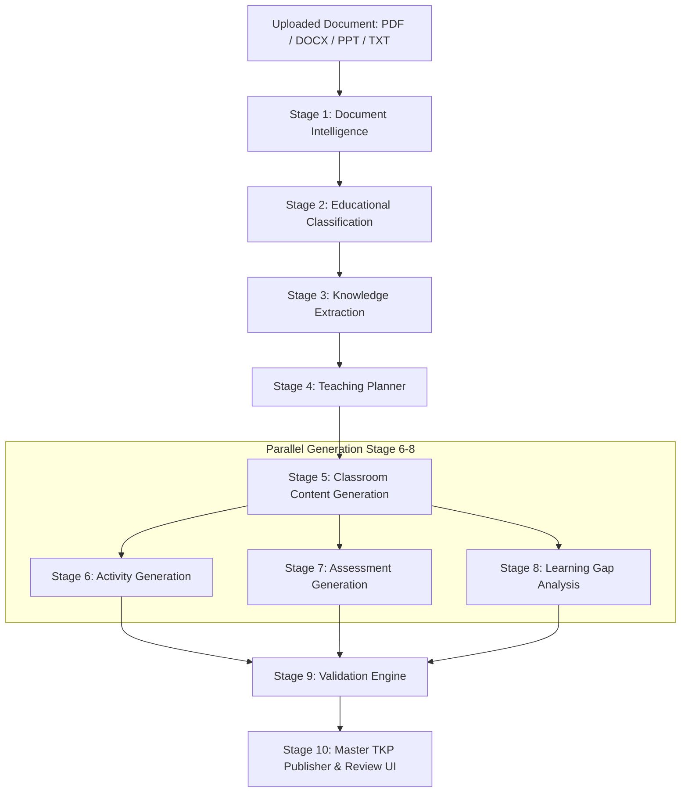

# Teacher AI Platform — AI Engineer Technical Assessment
---

## Architecture Overview

The system follows a modular microservice/pipeline architecture split into **10 distinct pedagogical stages** across 3 phases. Each stage is executed by a specialized AI agent with strict Pydantic schema validation, real-time progress streaming via Server-Sent Events (SSE), and automatic source-grounding validation.



---

## Key Features & Pedagogy

1. **Multi-Agent Pipeline**: 10 specialized agents operating with single-responsibility constraints.
2. **Bloom's Taxonomy Mapping**: All extracted learning objectives and assessment items are tagged according to Bloom's cognitive taxonomy (*Remember, Understand, Apply, Analyze, Evaluate, Create*).
3. **Classroom-Ready Teaching Artifacts**: Generates detailed word-for-word teacher scripts, blackboard writeups, warm-ups (Entry Tickets), wrap-ups (Exit Tickets), homework items, and motivational anecdotes ("Mentor Moments").
4. **Learning Gap Diagnostics**: Detects common student misconceptions, categorizes severity, provides diagnostic questions, and outlines step-by-step remedial actions.
5. **Validation & Anti-Hallucination Engine**: Runs 8 automated quality checks including source grounding (verifying concepts exist in original text), schema completeness, and objective coverage.
6. **Real-time SSE Progress Streaming**: Server-Sent Events stream live percentage updates and log messages directly to the frontend interface.

---

## Technology Stack

* **Backend Framework**: FastAPI (Python 3.11) with Async Task Queues
* **LLM Engine**: Google Gemini API (`gemini-3.5-flash`)
* **Data Schemas & Validation**: Pydantic v2 (Strict Schema Enforcement)
* **Document Parsing**: PyMuPDF (`fitz`), `python-docx`, `python-pptx`
* **Real-time Streaming**: SSE (Server-Sent Events via `sse-starlette`)
* **Frontend UI**: Streamlit with Custom Responsive CSS
* **Observability & Logging**: `structlog`

---

## Local Setup Instructions

### 1. Prerequisites
- Python 3.11+ installed
- Google Gemini API Key (Get free key from [Google AI Studio](https://aistudio.google.com/))

### 2. Clone & Install Dependencies
```bash
git clone https://github.com/kbxai/teacher-ai-platform.git
cd teacher-ai-platform

# Install backend dependencies
pip install -r backend/requirements.txt
```

### 3. Environment Configuration
Create a `.env` file in the root directory:
```env
GEMINI_API_KEY=your_actual_gemini_api_key_here
GROQ_API_KEY=your_actual_groq_api_key_here
NVIDIA_API_KEY=your_actual_nvidia_api_key_here

```

### 4. Run the Backend API Server
```bash
python -m uvicorn backend.main:app --reload --port 8000
```
Backend API will be running at `http://localhost:8000`. Swagger API docs are at `http://localhost:8000/docs`.

### 5. Run the Streamlit Frontend UI (in a new terminal window)
```bash
streamlit run frontend/app.py
```
Frontend UI will open automatically at `http://localhost:8501`.

---

## Repository Structure

```
teacher-ai/
├── backend/
│   ├── main.py                  # FastAPI endpoints & CORS
│   ├── config.py                # Environment variables & model configuration
│   ├── pipeline.py              # Main orchestration engine & SSE event queue
│   ├── agents/
│   │   ├── document_parser.py   # Stage 1: Document Intelligence
│   │   ├── classifier.py        # Stage 2: Educational Classification
│   │   ├── knowledge_extractor.py # Stage 3: Knowledge Extraction
│   │   ├── teaching_planner.py  # Stage 4: Multi-period Teaching Planner
│   │   ├── content_generator.py # Stage 5: Classroom Content Generator
│   │   ├── activity_generator.py# Stage 6: Diverse Activity Generator
│   │   ├── assessment_generator.py # Stage 7: Assessment Engine
│   │   ├── gap_analyzer.py      # Stage 8: Learning Gap Analyzer
│   │   ├── validator.py         # Stage 9: Automated Validation Engine
│   │   ├── publisher.py         # Stage 10: Master TKP Publisher
│   │   └── llm_utils.py         # LLM client wrapper with exponential backoff retries
│   ├── prompts/
│   │   └── templates.py         # Pedagogical prompt engineering templates
│   └── schemas/
│       └── models.py            # Pydantic schema data contracts
├── frontend/
│   ├── app.py                   # Streamlit interactive dashboard
│   └── requirements.txt
├── samples/
│   ├── sample_tkp_1.json        # Pre-generated output 1 (STEM - Physics)
│   └── sample_tkp_2.json        # Pre-generated output 2 (Humanities - History)
├── uploads/                     # Storage for raw uploaded files
├── outputs/                     # Generated TKP JSON packages
└── README.md                    # System documentation
```

---

## Live Prototype & Deployment

* **Deployed Web Prototype**: [aixteacher](https://aixteacher.streamlit.app/)
* **Source Code**: [GitHub Repository URL](https://github.com/kbxai/teacher-ai-platform)

---

## Evaluation Criteria Alignment

| Evaluation Criteria | Weight | Implementation Details |
| :--- | :--- | :--- |
| **Content Generation & Versatility** | 25% | Multi-subject adaptability (STEM equations vs Humanities narratives), diverse activities, full assessments with rubrics. |
| **Educational Understanding** | 20% | Automatic classification, Bloom's Taxonomy tagging, structured knowledge graphs. |
| **Teaching Planning** | 20% | Pedagogically sequenced multi-period breakdown with duration allocations. |
| **Document Intelligence** | 15% | Multi-format parser (PDF, DOCX, PPTX, TXT) preserving section hierarchy and mathematical LaTeX formatting. |
| **Engineering & Architecture** | 15% | Asynchronous multi-agent execution, SSE progress streaming, 8-point automated validation engine. |
| **Documentation & Demo** | 5% | Streamlit dashboard UI, clean architecture documentation, pre-generated sample outputs. |
